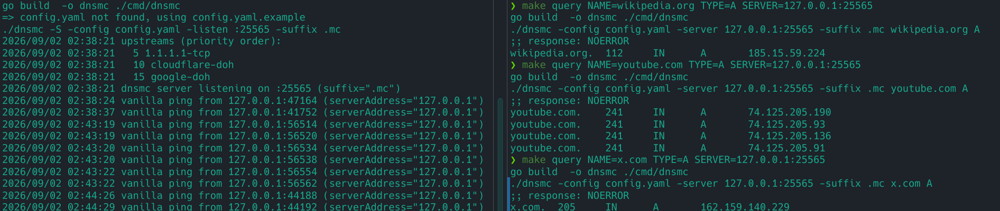
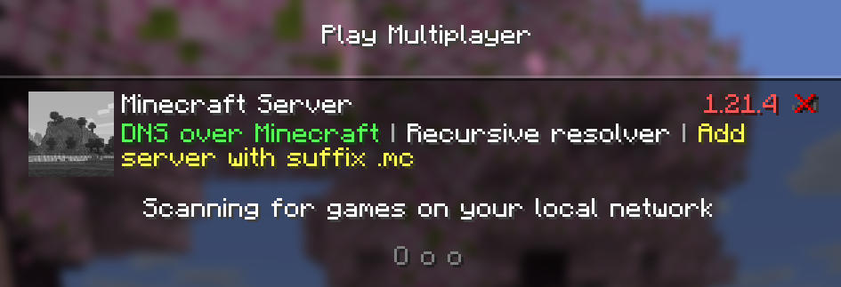

# dns-over-minecraft

Recursive DNS server over Minecraft network protocol (Java Edition).





Hides DNS queries inside real gaming protocol. Useful for censorship circumvention.

The **server** accepts vanilla-like pings on `:25565`, decodes `serverAddress = base32(dnsWire)+".mc"`
to a `dns.Msg`, resolves via priority-ordered upstreams (TCP/DoT/DoH) and returns a base64-encoded payload inside the server's **favicon** (`data:image/png;base64,...`).

Outside world sees server just as a regular minecraft server - fake motd, fake player count

## How it works

```mermaid
flowchart TB
    A["web browser / apps / dig / resolv.conf"] -->|"DNS (UDP+TCP)"| CS["dnsmc client service<br/>-C -listen 127.0.0.1:53"]
    CS -->|"Minecraft protocol<br/>round-robin"| S1["dnsmc server #1 · :25565"]
    CS -->|"Minecraft protocol"| S2["dnsmc server #2 · :25565"]
    CS -->|"Minecraft protocol"| S3["dnsmc server #3 · :25565"]
    
    S1 --> U1[["Upstream: 1.1.1.1 TCP"]]
    S1 --> U2[["Upstream: Cloudflare DoH"]]

    S2 --> U2[["Upstream: Cloudflare DoH"]]
    S2 --> U3[["Upstream: Google DoH"]]

    S3 --> U1[["Upstream: 1.1.1.1 TCP"]]
    S3 --> U3[["Upstream: Google DoH"]]
```



One dnsmc **client service** can talk to multiple **dnsmc servers** (round-robin, failing over to
the next when one is unreachable); each **server** forwards to its own priority-ordered **upstream
DNS providers** (plain TCP, DoT, or DoH)

# Quick setup

## Requirements

- **Docker compose** for server deployment
- **Go 1.26+** for running on local machine
- Linux

## Run the server with Docker

Real-world example of deployment using ansible can be found [here](https://github.com/kuleshov-aleksei/x-ui-ansible/blob/master/roles/dnsmc/tasks/main.yaml)

The repo ships a `docker-compose.yml` that builds the image from this source and runs the server
with your `config.yaml`

**1. Create `config.yaml`** in the repo root (copy the sample or paste the minimal one below):

```bash
cp config.yaml.example config.yaml
```

**2. Start the server:**

```bash
docker compose up -d --build
```

**3. Verify it is listening:**

```bash
docker compose ps
docker compose logs -f dnsmc-server   # should print "dnsmc server listening on :25565"
```

**4. Query it**

On local machine with compiled client

```bash
./dnsmc -server <ip of remote server>:25565 google.com A
```

**5. Stop it:**

```bash
docker compose down
```

## Configure the server

Use bootstrap command to quickly generate sample server with random name and random player count:
```bash
./bootstrap/create_server_config.sh -o config.yaml
```

OR create it manually:

Minimal `config.yaml` with the essentials (MOTD, shared passphrase, upstreams, custom records):

```yaml
# config.yaml — dnsmc server
listen: "0.0.0.0:25565"          # vanilla-looking Minecraft server port
server:
  motd: "§6§lEpic Network §7| §eSurvival"
  versionName: "26.1.2"
  versionProtocol: 775
  maxPlayers: 20
  onlinePlayers: 6                 # peak at 18:00 UTC (dip ~half at 06:00 UTC)
  sample:                          # must cover all possible online players
    - name: "xX_Steve_Xx"
      id: "b1f2c3d4-5e6f-4a7b-8c9d-0e1f2a3b4c5d"
    - name: "Miner_Joe"
      id: "a2c3d4e5-6f70-4a8b-9c0d-1e2f3a4b5c6d"
    - name: "Notch_Fanatic"
      id: "c3d4e5f6-7081-4b9a-ac0d-1e2f3a4b5c6e"
    - name: "Herobrine_Watcher"
      id: "d4e5f607-8192-4c0b-bd0e-1f2a3b4c5d6f"
    - name: "CreeperHunter"
      id: "e5f60718-92a3-4d0c-8e0f-20a1b2c3d4e5"
    - name: "Redstone_Guy"
      id: "f6071829-a3b4-4e0d-9f10-31a2b3c4d5e6"
security:
  passphrase: "dns42mc"          # shared secret; clients must send p.<passphrase>. — see below
  rateLimit: 100                 # per-IP queries/sec on the MC port; 0 disables
  maxConnections: 1024           # concurrent connection cap; 0 disables
upstreams:
  - name: cloudflare-tcp         # tried first (lowest priority number)
    type: tcp
    addr: "1.1.1.1:53"
    priority: 5
    timeout: 2s
  - name: cloudflare-doh
    type: doh
    url: "https://cloudflare-dns.com/dns-query"
    priority: 10
    timeout: 2s
```

See `config.yaml.example` for the full reference

## Configure the client

The client is a local DNS resolver that forwards every query to your dnsmc server(s) over Minecraft,
with an in-memory client cache in front. Point `/etc/resolv.conf` at it, or use it as a
dns-over-https replacement.

Minimal `config.client.yaml`:

```yaml
# config.client.yaml — local DNS client service (dnsmc -C)
suffix: ".mc"
client:
  listen: "127.0.0.1:53"         # host DNS listener (UDP+TCP); :53 needs root
  servers:                       # rotate round-robin; fail over when one is unreachable
    - "<ipA>:25565"              # add more dnsmc servers here
    - "<ipB>:25565"              # or use only 1
  passphrase: "dns42mc"          # must match the server's security.passphrase
  cache:
    disabled: false              # true = forward every query to a server (no client cache)
    size: 2048
    ttl: 5m
    negativeTtl: 30s
```

See `./dnsmc -h` for more subcommands (`encode`, `decode`, `hosts`).

## Install the client as a systemd service

The repo ships a hardened unit file (`deploy/dnsmc-client.service`). It runs as a dedicated `dnsmc`
user and grants `CAP_NET_BIND_SERVICE` so it can bind `127.0.0.1:53` without running as root.

**1. Install the binary and the client config:**

```bash
sudo cp dnsmc /usr/local/bin/dnsmc
sudo useradd --system --no-create-home --shell /usr/sbin/nologin dnsmc
sudo mkdir -p /etc/dnsmc
sudo cp config.client.yaml /etc/dnsmc/config.client.yaml   # your client config from above
sudo chown -R dnsmc:dnsmc /etc/dnsmc
```

**2. Install and start the unit:**

```bash
sudo cp deploy/dnsmc-client.service /etc/systemd/system/
sudo systemctl daemon-reload
sudo systemctl enable --now dnsmc-client
systemctl status dnsmc-client   # should be "active (running)"
```

**3. Verify:**

```bash
dig @127.0.0.1 google.com A
```

The client service now starts on boot and restarts automatically on failure. Logs are visible via
`journalctl -u dnsmc-client -f`. If your config uses a high port (e.g. `127.0.0.1:5300`) instead of
`:53`, remove the two `AmbientCapabilities`/`CapabilityBoundingSet` lines from the unit file.

---

# Extended notes

## Security / abuse surface

By default the server binds `:25565` on all interfaces, so anyone reachable could use it as an
anonymous DNS relay. The `security:` block tightens this:

- **`passphrase`** — a shared-secret ACL. When set, every client must prefix its server address
  with `p.<passphrase>.` (verified constant-time server-side); the matching client service sets
  `client.passphrase`. Unauthorized clients are answered like a normal Minecraft server (vanilla
  status + ping) and never resolve. Keep it short (e.g. 6 lowercase alphanumeric chars) — every
  character consumes the 255-byte address budget, and it is transmitted in the plaintext handshake,
  so treat it as a capability token, not a transport secret.
- **`rateLimit`** — per-IP token bucket on the Minecraft port (default 100 qps, `0` disables).
  Over-quota peers get the vanilla reply and are dropped.
- **`maxConnections`** — a semaphore capping concurrent accepted connections (default 1024,
  `0` disables); excess connections are rejected with the vanilla reply.
- **`maxFrameSize`** — inbound handshake/status/ping frame payload ceiling (default 4096),
  preventing the old 1MB-per-connection allocation; the handshake phase also has a 2s budget so
  slowloris can't hold connections open.

## Generate test queries

`make load` sends a light stream of `dig` queries to a running client service
(default `127.0.0.1:5300`) that forwards to your server — handy for watching
`logging.performance`/`logging.analytics`. It assumes the server and client service are already
running (e.g. `make run-server` and `make client-service CLIENT_LISTEN=127.0.0.1:5300`), and with
`client.cache.disabled: true` repeated domains reach the server and build up cache hits. Override
with `RESOLVER=`, `PORT=`, `QUERIES=`, `DELAY=`.


## Protocol

Protocol versions should match release name. Some common values:

| Release name | Version number |
|-|-|
| 26.2 | 776 |
| 26.1.2 | 775 |
| 1.21.10 | 773 |
| 1.20.1 | 763 |
| 1.18 | 757 |
| 1.12.2 | 340 |

Wire vanilla-identical: `Handshake(nextState=1) + StatusRequest`, suffix `.mc`, base32 query,
compact base64 response in the Status JSON favicon.

Queries whose encoded address would exceed 255 chars are **auto-fragmented**: the base32 query is
split across multiple handshake/status connections (`n.<nonce>.<piece>.<suffix>`, index/total
encoded in the handshake port), reassembled server-side, and answered on the final fragment.

Responses always ride in the status **favicon** (`data:image/png;base64,<payload>`) while
`description.text` shows the configured MOTD, so the status looks like a normal Minecraft server to
packet analysis.

## System service

See `deploy/dnsmc.service` (server) and `deploy/dnsmc-client.service` (client).
